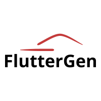

<p align="center">
  
</p>
<p align="center">
  <a href="https://pub.dartlang.org/packages/flutter_gen">
    
  </a>
  </a>
  <a href="https://github.com/wasabeef/FlutterGen/actions?query=workflow%3A%22Flutter+CI%22">
    
  </a>
</p>

The Flutter code generator for your assets, fonts, colors, localize, … — Get rid of all String-based APIs.

Inspired by [SwiftGen](https://github.com/SwiftGen/SwiftGen).

## Motivation.

Using image paths as strings are not safe.

```yaml
# pubspec.yaml
flutter:
  assets:
    - assets/images/logo.png
```

❌ **Bad**  
What would happen if you made a typo?
```dart
Widget build(BuildContext context) {
  return Image(image: AssetImage('assets/images/logo.png'));
}
```

⭕️ **Good**  
We need a way to make it safe.
```dart
Widget build(BuildContext context) {
  return Asset.logo.image();
}
```

## Installation

Using [`build_runner`](https://pub.dev/packages/build_runner).  
Run build_runner after the configuration pubspec.yaml.

```yaml
# pubspec.yaml
dev_dependencies:
  build_runner:
  flutter_gen: 
```
```sh
$ flutter pub get
$ flutter packages pub run build_runner build
```

## Configuration file

All are generated based on [`pubspec.yaml`](https://dart.dev/tools/pub/pubspec).

## Available Parsers

### Assets

No specific configurations for FlutterGen are required.  
Check the: [Adding assets and images#Specifying assets](https://flutter.dev/docs/development/ui/assets-and-images#specifying-assets)

```yaml
# pubspec.yaml
flutter:
  assets:
    - assets/images/
    - assets/images/chip3/chip3.jpg
    - assets/images/chip4/
    - assets/fruits.json
```

These configurations will generate `asset.gen.dart` under `lib/gen/` dir.

#### Usage Example

`Asset.chip3` is an implementation of [`AssetImage class`](https://api.flutter.dev/flutter/painting/AssetImage-class.html).  
`Asset.chip3.image(...)` returns [`Image class`](https://api.flutter.dev/flutter/widgets/Image-class.html).  
`Asset.chip3.path` just returns the path string.  
```dart
Widget build(BuildContext context) {
  return Image(image: Asset.chip3);
}

Widget build(BuildContext context) {
  return Asset.chip3.image(
    width: 120,
    height: 120,
    fit: BoxFit.scaleDown,
  );
  
Widget build(BuildContext context) {
  // Asset.chip3.path = 'assets/images/chip3/chip3.jpg'
  return Image.asset(Asset.chip3.path);
}

```

<details><summary>Example of code generated by FlutterGen</summary>
<p>

```dart
/// GENERATED CODE - DO NOT MODIFY BY HAND
/// *****************************************************
///  FlutterGen
/// *****************************************************

import 'package:flutter/widgets.dart';

class AssetGenImage extends AssetImage {
  const AssetGenImage(String assetName)
      : _assetName = assetName,
        super(assetName);
  final String _assetName;

  Image image({
    ImageFrameBuilder frameBuilder,
    ImageLoadingBuilder loadingBuilder,
    ImageErrorWidgetBuilder errorBuilder,
    String semanticLabel,
    bool excludeFromSemantics = false,
    double width,
    double height,
    Color color,
    BlendMode colorBlendMode,
    BoxFit fit,
    AlignmentGeometry alignment = Alignment.center,
    ImageRepeat repeat = ImageRepeat.noRepeat,
    Rect centerSlice,
    bool matchTextDirection = false,
    bool gaplessPlayback = false,
    bool isAntiAlias = false,
    FilterQuality filterQuality = FilterQuality.low,
  }) {
    return Image(
      image: this,
      frameBuilder: frameBuilder,
      loadingBuilder: loadingBuilder,
      errorBuilder: errorBuilder,
      semanticLabel: semanticLabel,
      excludeFromSemantics: excludeFromSemantics,
      width: width,
      height: height,
      color: color,
      colorBlendMode: colorBlendMode,
      fit: fit,
      alignment: alignment,
      repeat: repeat,
      centerSlice: centerSlice,
      matchTextDirection: matchTextDirection,
      gaplessPlayback: gaplessPlayback,
      isAntiAlias: isAntiAlias,
      filterQuality: filterQuality,
    );
  }

  String get path => _assetName;
}

class Asset {
  Asset._();

  static const String paint = 'assets/images/paint.svg';
  static AssetGenImage chip2 = const AssetGenImage('assets/images/chip2.jpg');
  static AssetGenImage chip1 = const AssetGenImage('assets/images/chip1.jpg');
  static AssetGenImage logo = const AssetGenImage('assets/images/logo.png');
  static AssetGenImage profile =
      const AssetGenImage('assets/images/profile.jpg');
  static AssetGenImage chip3 =
      const AssetGenImage('assets/images/chip3/chip3.jpg');
  static AssetGenImage chip4 =
      const AssetGenImage('assets/images/chip4/chip4.jpg');
  static const String fruits = 'assets/fruits.json';
}

```

</p>
</details>

### Fonts
No specific configurations for FlutterGen are required.  
Check the: [Use a custom font](https://flutter.dev/docs/cookbook/design/fonts)

```yaml
# pubspec.yaml
flutter:
  fonts:
    - family: Raleway
      fonts:
        - asset: assets/fonts/Raleway-Regular.ttf
        - asset: assets/fonts/Raleway-Italic.ttf
          style: italic
    - family: RobotoMono
      fonts:
        - asset: assets/fonts/RobotoMono-Regular.ttf
        - asset: assets/fonts/RobotoMono-Bold.ttf
          weight: 700

```

These configurations will generate `font.gen.dart` under `lib/gen/` dir.

#### Usage Example

```dart
Text(
  'Hi there, I\'m FlutterGen',
  style: TextStyle(
    fontFamily: FontFamily.robotoMono,
    fontFamilyFallback: const [FontFamily.raleway],
  ),
```

<details><summary>Example of code generated by FlutterGen</summary>
<p>

```dart
/// GENERATED CODE - DO NOT MODIFY BY HAND
/// *****************************************************
///  FlutterGen
/// *****************************************************

class FontFamily {
  FontFamily._();

  static const String raleway = 'Raleway';
  static const String robotoMono = 'RobotoMono';
}

```

</p>
</details>

### Colors

```yaml
# pubspec.yaml
flutter_gen:
  colors:
    inputs:
      - assets/color/colors.xml
      - assets/color/colors2.json
      - assets/color/colors3.xml
```

The input file supports the following formats.

* a [XML file](example/assets/color/colors.xml), the same format as the Android colors.xml files, containing tags
```
<color name="milk_tea">#F5CB84</color>
<color name="cinnamon">#955E1C</color>
<color name="black_50">#80000000</color>
```

* a [JSON file](example/assets/color/colors2.json), representing a dictionary of names -> values, each value being the hex representation of the color
```
{
  "disabled": "#666666",
  "accent_red": "#FF4D4D",
}
```

These configurations will generate `color.gen.dart` under `lib/gen/` dir.

#### Usage Example

```dart
Text(
  'Hi there, I\'m FlutterGen',
  style: TextStyle(
    color: ColorName.denim,
  ),
```

<details><summary>Example of code generated by FlutterGen</summary>
<p>

```dart
/// GENERATED CODE - DO NOT MODIFY BY HAND
/// *****************************************************
///  FlutterGen
/// *****************************************************

import 'package:flutter/painting.dart';

class ColorName {
  ColorName._();

  static Color white = const Color(0xFFFFFFFF);
  static Color gray70 = const Color(0xFFEEEEEE);
  static Color gray150 = const Color(0xFFD8D8D8);
  static Color gray410 = const Color(0xFF979797);
  static Color gray470 = const Color(0xFF878787);
  static Color gray550 = const Color(0xFF737373);
  static Color gray600 = const Color(0xFF666666);
  static Color gray620 = const Color(0xFF606060);
  static Color gray680 = const Color(0xFF525252);
  static Color gray770 = const Color(0xFF37373D);
  static Color gray800 = const Color(0xFF333333);
  static Color gray860 = const Color(0xFF222226);
  static Color gray880 = const Color(0xFF1D1D22);
  static Color gray900 = const Color(0xFF18181C);
  static Color gray910 = const Color(0xFF141418);
  static Color black = const Color(0xFF000000);
  static Color seaPink = const Color(0xFFEB9798);
  static Color coral = const Color(0xFFFE6363);
  static Color strawberry = const Color(0xFFFF4D4D);
  static Color crimsonRed = const Color(0xFFCF2A2A);
  static Color rustRed = const Color(0xFF421E21);
  static Color milkTea = const Color(0xFFF5CB84);
  static Color cornBrond = const Color(0xFFF5CB84);
  static Color yellowOcher = const Color(0xFFDF9527);
  static Color cinnamon = const Color(0xFF955E1C);
  static Color tulipTree = const Color(0xFFE6A53A);
  static Color gullGray = const Color(0xFFA1B3BC);
  static Color fleryOrange = const Color(0xFFB36111);
  static Color denim = const Color(0xFF127DB8);
  static Color forestGreen = const Color(0xFF238833);
  static Color amazon = const Color(0xFF367A62);
  static Color copperCanyon = const Color(0xFF8A4213);
  static Color russet = const Color(0xFF7B5A19);
  static Color bronzetone = const Color(0xFF533C10);
  static Color bush = const Color(0xFF0F3A2B);
  static Color bronze = const Color(0xFF421F0A);
  static Color highEmphasis = const Color(0xFFEEEEEE);
  static Color mediumEmphasis = const Color(0xFF979797);
  static Color disabled = const Color(0xFF666666);
  static Color accentRed = const Color(0xFFFF4D4D);
  static Color accentYellow = const Color(0xFFF2B756);
  static Color highEmphasis30 = const Color(0x4DEEEEEE);
  static Color white00016 = const Color(0x29FFFFFF);
  static Color white00020 = const Color(0x33FFFFFF);
  static Color white00030 = const Color(0x4DFFFFFF);
  static Color white00032 = const Color(0x52FFFFFF);
  static Color white00040 = const Color(0x66FFFFFF);
  static Color white00060 = const Color(0x99FFFFFF);
  static Color gray91000 = const Color(0x00141418);
  static Color gray91030 = const Color(0x4D141418);
  static Color gray91070 = const Color(0xB3141418);
  static Color gray910100 = const Color(0xFF141418);
  static Color colorAccentDark15 = const Color(0x26CF2B2B);
  static Color colorAccentDark20 = const Color(0x33CF2B2B);
  static Color black30 = const Color(0x4D000000);
  static Color black40 = const Color(0x66000000);
  static Color black50 = const Color(0x80000000);
  static Color black60 = const Color(0x99000000);
}
```

</p>
</details>

## Issues

Please file FlutterGen specific issues, bugs, or feature requests in our [issue tracker](https://github.com/wasabeef/flutter_gen/issues/new).

Plugin issues that are not specific to FlutterGen can be filed in the [Flutter issue tracker](https://github.com/flutter/flutter/issues/new).

## Contributing

Let's develop together.

If you wish to contribute a change to any of the existing plugins in this repo,
please review our [contribution guide](https://github.com/wasabeef/flutter_gen/blob/master/CONTRIBUTING.md)
and open a [pull request](https://github.com/wasabeef/flutter_gen/pulls).

